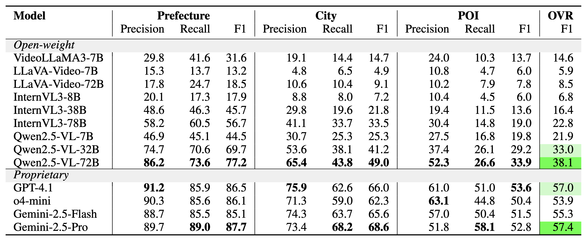
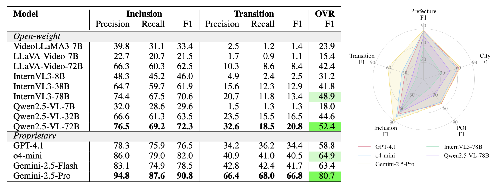

<div align="center" style="font-family: charter;">

<h1><i>VIR-Bench</i>:</br> Evaluating Geospatial and Temporal Understanding of MLLMs via Travel Video Itinerary Reconstruction</h1>


<br />

<a href="FIXME" target="_blank">
    
</a>

<div>
    <a href="https://www.conan1024hao.com/" target="_blank">Hao Wang*</a><sup>1</sup>,
    <a href="https://www.linkedin.com/in/eiki-murata/" target="_blank">Eiki Murata*</a><sup>2,3</sup>,
    <span>Lingfang Zhang<sup>1</sup>,</span>
    <span>Ayako Sato<sup>2</sup>,</span>
    <span>So Fukuda<sup>1</sup>,</span>
    <span>Ziqi Yin<sup>1</sup>,</span>
    <span>Wentao Hu<sup>1</sup>,</span>
    <span>Keisuke Nakao<sup>1</sup>,</span>
    <span>Yusuke Nakamura<sup>1</sup>,</span>
    <span>Sebastian Zwirner<sup>1</sup>,</span>
    <span>Yi-Chia Chen<sup>1</sup>,</span>
    <span>Hiroyuki Otomo<sup>2</sup>,</span>
    <span>Hiroki Ouchi<sup>4,2</sup>,</span>
    <span>Daisuke Kawahara<sup>1</sup></span>
</div>
<br />

<div>
    <sup>1</sup>Waseda University&emsp;
    <sup>2</sup>CyberAgent, Inc.&emsp;
    <sup>3</sup>AI Shift, Inc.&emsp;
    <sup>4</sup>Nara Institute of Science and Technology&emsp;
</div>

<div>
    * Equal contribution
</div>
<br />

<p align="justify"><i>Recent advances in multimodal large language models (MLLMs) have significantly enhanced video understanding capabilities, opening new possibilities for practical applications. Yet current video benchmarks focus largely on indoor scenes or short-range outdoor activities, leaving the challenges associated with long-distance travel largely unexplored. Mastering extended geospatial-temporal trajectories is critical for next-generation MLLMs, underpinning real-world tasks such as embodied-AI planning and navigation. To bridge this gap, we present VIR-Bench, a novel benchmark consisting of 200 travel videos that frames itinerary reconstruction as a challenging task designed to evaluate and push forward MLLMs' geospatial-temporal intelligence. Experimental results reveal that state-of-the-art MLLMs, including proprietary ones, struggle to achieve high scores, underscoring the difficulty of handling videos that span extended spatial and temporal scales. Moreover, we conduct an in-depth case study in which we develop a prototype travel-planning agent that leverages the insights gained from VIR-Bench. The agent’s markedly improved itinerary recommendations verify that our evaluation protocol not only benchmarks models effectively but also translates into concrete performance gains in user-facing applications.</i></p>

</div>

## Release
- `2025-09-20` :rocket: We released the benchmark together with its evaluation framework and agent implementations.

## Contents
- [Release](#release)
- [Contents](#contents)
- [VIR-Bench](#vir-bench)
- [Experiments](#experiments)
  - [Task Definition](#task-definition)
  - [Evaluation Setups](#evaluation-setups)
  - [Results](#results)
- [Download the Dataset](#download-the-dataset)
- [Run Your Own Evaluation](#run-your-own-evaluation)
  - [Installation](#installation)
  - [Evaluation](#evaluation)
- [Travel-planning Agent](#travel-planning-agent)
- [Acknowledgement](#acknowledgement)
- [Citation](#citation)

## VIR-Bench
**Overview:** VIR-Bench is a benchmark to evaluate long-range geospatial-temporal understanding via itinerary reconstruction from travel vlog videos. The core output is a directed visiting order graph: nodes represent locations at three granularities (prefecture, city, and point of interest (POI)) and edges represent two relations, inclusion for spatial hierarchy and transition for temporal adjacency. The dataset comprises 200 travel vlogs filmed across Japan, a major inbound tourism destination, each accompanied by a manually annotated and double-reviewed visiting order graph.

<p align="center">
  
</p>

## Experiments
### Task Definition
We aim to generate visiting order graphs directly from videos with MLLMs. However, our preliminary experiments revealed that this end-to-end approach is too difficult for current models. To address this, we decompose the task into two sub-tasks: node prediction and edge prediction.

**Node Prediction:** This task evaluates models’ geospatial understanding, akin to playing ``GeoGuessr’’. Given a video, MLLMs are asked to return all visited locations in three JSON lists (prefectures, cities, and POIs). For each POI, the model must also predict its category.

**Edge Prediction:** Given a video and all visited locations (gold labels, shuffled), MLLMs are asked to predict all inclusion and transition edges that constitute the video’s visiting order graph. The output should be a JSON list of tuples formatted as `<source, target, edge_type>`. Inclusion edge prediction evaluates models’ geospatial knowledge, while transition edge prediction assesses their temporal understanding.

### Evaluation Setups
We evaluate 13 mainstream MLLMs on VIR-Bench in a zero-shot setting. For each model, we use the maximum number of input frames allowed by its interface or pre-training configuration.

We evaluate models using macro-averaged precision, recall, and F1 across both node and edge prediction. For prefecture and city nodes, a prediction is considered correct only if it exactly matches the gold label's surface name. For POIs, we apply a lightweight sequence-matching algorithm: predictions with a similarity score above 0.7 (high similarity) are treated as correct; predictions with a score above 0.5 (moderate similarity) are also accepted if the predicted POI category matches the gold category; all others are treated incorrect. For inclusion and transition edges, a prediction is counted as correct only when the tuple `<source, target, edge_type>` exactly matches the gold tuple.

### Results
Across all five task categories, open-weight models continue to underperform proprietary models. The strongest open model, Qwen2.5-VL-72B, comes close to proprietary performance on the easier categories (prefecture node prediction and inclusion edge prediction), but substantial gaps remain on the harder categories (POI node prediction and transition edge prediction). Other open models perform markedly worse: the LLaVA-Video series and InternVL3-8B achieve only single-digit F1 in city and POI node prediction, and five of the nine models also remain in single digits on transition edge prediction. In the proprietary models, Gemini-2.5-Pro is the top performer, especially on edge prediction, yet its F1 scores for city/POI node and transition edge prediction remain around 60. Taken together, these findings indicate that VIR-Bench is highly challenging for current MLLMs and highlight persistent limitations in geospatial and temporal understanding.

<p align="center">
  
</p>

<p align="center">
  
</p>

## Download the Dataset
We release the VIR-Bench dataset strictly for research purposes, in compliance with <ins>Article 30-4 (Use for Non-Enjoyment Purposes)</ins> and <ins>Article 47-5 (Minor Use in Information Analysis Services)</ins> of the Japanese Copyright Act. Commercial use of any kind is strictly prohibited. The dataset may not be redistributed on servers outside Japan or under alternative licenses.

Dataset link: https://soya.infini-cloud.net/share/1302266998c5d047

Access phrase: `waseda`

To run evaluations, download and unzip `data.zip` and `videos.zip`, and organize them into the following directory structure.
`graphs.zip` (containing visiting order graphs in both pickle and SVG formats) is optional and not required for evaluation.
```
VIR-Bench/
  ├── data/
  │   ├── test-00000-of-00001.parquet
  │   └── validation-00000-of-00001.parquet
  ├── videos/
  │   ├── 0oODCXC3oms.mp4
  │   └── ...
```

## Run Your Own Evaluation
### Installation

### Evaluation

## Travel-planning Agent
We provide the full code for the travel-planning agent used in our paper. See the [agent/README](https://github.com/nlp-waseda/VIR-Bench/blob/main/agent/README.md) for setup and usage instructions.

## Acknowledgement
The evaluatiokn code is build upon [lmms-eval](https://github.com/EvolvingLMMs-Lab/lmms-eval). We acknowledge their team for providing this excellent toolkit for evaluating multimodal large language models.

## Citation
FIXME
